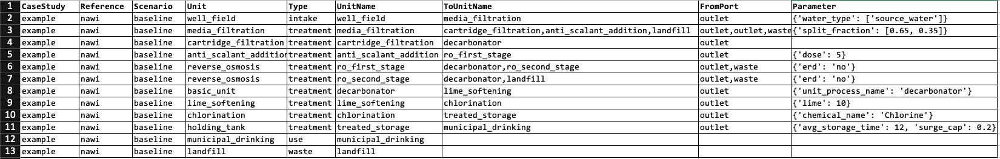

Treatment Train Setup
================================

``data/treatment_train_setup.xlsx``

This is the input file used to arrange and connect unit processes in the proper order and with
the proper flows to create a treatment train according to the user’s design.

The columns are:

* **CaseStudy**: The treatment facility name.

* **Reference**: The name of the project that is using the model.

* **Scenario**: The name of the scenario that the values correspond with, used to match water
  recovery and constituent removal rates specific to the case study-scenario combination.

* **Unit**: The unit process to be added to the train. The unit name in this column must match the
  exact naming convention of the unit process in the WaterTAP3 model.

* **Type**: The role of the unit process along the treatment train.

    * Options are "intake", "treatment", "use", or "waste"

    * "intake" types are declared for units that begin the treatment train and require at least
      one source water.

    * "use" types are declared for units considered to have a treated water product. The volume
      of water that goes through these units is used to calculate LCOW. Therefore, there must
      be at least one unit declared as the use with a flow rate greater than zero. These units
      do not have an outlet or waste port connected to another unit (i.e. they are a terminal unit)

    * "treatment" types are declared for treatment units. These units can have any number of
      inlet, outlet, and waste ports.

    * "waste" types are declared for units that handle terminal waste streams for the facility.
      These units can have any number of inlet ports but don't have outlet or waste ports that
      connect to another unit (i.e. they are a terminal unit).
|
* **UnitName**: The unit process name as defined by the user.

    * Each unit name must be unique. For example, if there are two of the same unit processes
      under the **Unit** column (e.g. ``chlorination``), the first chlorination unit name could be
      ``chlorination_a`` and the second could be ``chlorination_b``. The unit in this column is
      connected to the unit defined in the **ToUnitName** column.
|
* **ToUnitName**: The **UnitName** for a unit process in a different row that connects to the
  **UnitName** for the current row. The user can include any number of destination units by
  including them in this column separated by a column and with *no space in between*.

    * Example: If the user wanted ``media_filtration`` to split outlet flow 50/50 to
      ``anti_scalant_addition`` and ``chlorination_b``, they would put
      ``anit_scalant_addition,chlorination_b`` in the **ToUnitName** column for the
      ``media_filtration`` row.

    * This is better explained in the example below.
|
* **FromPort**: For each unit process identified in the **ToUnitName** column, there needs to be a
  corresponding port, either “outlet” or “waste”, that tells the model how to connect the current
  unit to the next unit in the train. If there is more than one port, the types are separated by a
  comma and *no space in between*.

    * Example: If the user wanted the treated flow from ``media_filtration`` to go to
      ``anti_scalant_addition`` and the waste flow to go to ``backwash_solids_handling``, put
      ``outlet,waste`` in the **FromPort** column for the ``media_filtration`` row.
|
* **Parameter**: Used to characterize each unit process. All parameter formats are provided as python dictionaries,
  meaning the cell text must be enclosed by curly braces ``{ }``, have quotation marks around
  parameter names, commas between each parameter, and a colon ``:`` separating the parameter name
  and the value for that parameter.

    * Example: If ``“chemical_name”``, and ``"dose"`` are the parameter names, the proper format is:

        * ``{'chemical_name': 'Chlorine', 'dose': 5}``

    * Specifics for required and optional unit parameters for each unit are provided in the
      documentation for each unit model.

    * If the value for an input parameter is a word (e.g. chemical name), it *must* be in single
      ``' '`` or double ``" "`` quotes. If it is a number, it *must not* be in quotes.
|
|
Treatment Train Example
*****************************

Below is an example treatment train input file with various unit processes, flow splits, and
waste streams.

* Row 2: ``well_field`` is the "intake" unit for the treatment train. All the flow from the
  ``well_field`` flows to ``media_filtration``.

    * "intake" units must have a ``water_type`` in the **Parameter** column that corresponds to
      the proper source water found in ``case_study_water_sources.csv``

    * The source water name must be in quotes and enclosed in brackets ``[ ]`` even if there is
      only one source water for the treatment train. This is to facilitate the inclusion of
      multiple source waters for a single intake.
|
* Row 3: Outlets for ``media_filtration`` flows to both ``cartridge_filtration`` and
  ``ro_first_stage``. There is also a waste stream that flows to ``landfill``.

    * The user can designate any split fraction they want in the **Parameter** column by using the
      ``"split_fraction"`` parameter.

    * Split fractions provided with ``"split_fraction"`` must be provided in brackets ``[ ]`` and
      the order of values in the split fraction correspond to the order of units in **ToUnitName**.
      In this case, 65% of the flow from ``media_filtration`` flows to ``cartridge_filtration``
      and 35% flows to ``anit_scalant_addition``.

    * The unit paramater ``"split_fraction"`` must be provided in **Parameter** even if the split
      is 50/50 (i.e. ``{'split_fraction': [0.5, 0.5]}``).
|
* Row 4: Flow from ``cartridge_filtration`` flows to ``decarbonator``.

    * Note that this flow stream is bypassing the two-stage reverse osmosis process. You can
      arrange flows in any configuration desired provided the input sheet is correct.
|
* Row 5: The chemical addition unit ``anti_scalant_addition`` receives 35% of flow from
  ``media_filtration``

    * This unit requires a ``"dose"`` in the **Parameter** column.
|
* Row 6: The permeate stream from ``ro_first_stage`` flows to ``decarbonator`` and the reject
  (i.e. waste) stream flows to ``ro_second_stage``

    * Note that the **ToUnitName** column does not match the **Unit** column. The user can
      provide any name they want for the unit in **ToUnitName**, but the **Unit** entry must match
      *exactly* the name of the Python file for that unit (without '.py' appended)

    * In this case, because there are two ``reverse_osmosis`` units, they must have different
      names for WaterTAP3 to correct the unit flows properly.
|
* Row 7: The permeate stream from ``ro_second_stage`` also flows to ``decarbonator`` and the reject
  (i.e. waste) stream flows to ``landfill``

    * Both ``reverse_osmosis`` units require an ``"erd"`` parameter to indicate if the model
      should include an energy recovery device.
|
* Row 8: The ``decarbonator`` is receiving flows from ``cartridge_filtration``,
  ``ro_first_stage``, and ``ro_second_stage``.

    * The ``decarbonator`` is a basic unit so must have a **Parameter** ``"unit_process_name"``
      that matches the name of the desired unit in ``basic_unit.csv``.

    * More information on basic units is provided in the basic unit documentation.
|
* Row 9-11: For each of these rows, 100% of the flow from the **UnitName** is flowing to
  **ToUnitName**.

    * Each have entries in **Parameters** as required.
|
* Row 12: For this treatment train ``municipal_drinking`` is the "use". Any water that flows
  through this unit is used to calculate LCOW.

    * The **ToUnitName** is empty for "use" units since flow does not go anywhere from here. It
      is a terminal unit. Similarly, it does not need an entry in **FromPort**

..  raw:: pdf

    PageBreak