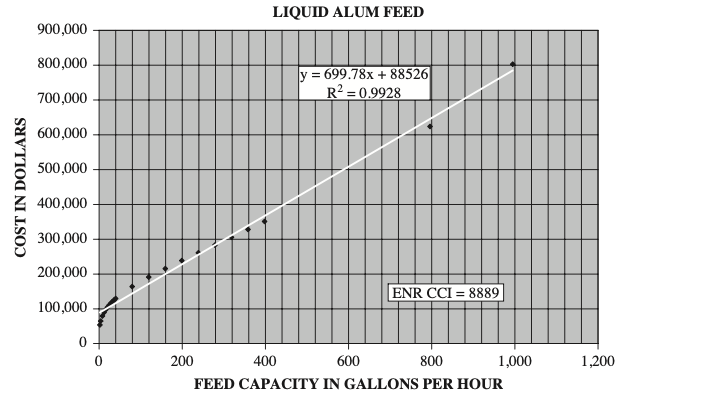

Alum Addition
=================

In general, costs for chemical additions in WaterTAP3 are a function of the chemical dose and the
flow in. The chemical solution flow is calculated from these two values and assumed solution
densities to use in a cost curve. All chemical additions assume 2 chemical addition units.

Capital Costs
---------------
The chemical solution flow :math:`\big( S \big)` is used in a cost curve of the general form:

:math:`\text{Cost} = \big( S a \big) ^ b`

For a single alum addition unit, `a` = 15408 and `b` = 0.5479. The full cost equation in
WaterTAP3 is:

:math:`\text{Cost } ($MM) = N_{units}\big( 15408 S \big) ^{0.5479}\times 10^{-6}`

These parameters were determined by fitting data from FIGURE 5.5.15 - LIQUID ALUM FEED to the
general form.

Assumptions:
****************

* Number of units = 2
* Alum solution density [kg/m3] = 1360
* Ratio in solution = 50%

Reference:
*************

| Cost Estimating Manual for Water Treatment Facilities (2008)
| William McGivney & Susumu Kawamura
| DOI:10.1002/9780470260036

Electricity Cost
------------------

Electricity intensity for chemical additions in WaterTAP3 is based off the pump used to inject
the chemical solution, the chemical solution flow rate, and the influent flow rate. The model
assumes:

* Lift height = 100 ft
* Pump efficiency = 90%
* Motor efficiency = 90%

Alum Addition Module
----------------------------------------

.. autoclass:: watertap3.wt_units.alum_addition.UnitProcess
   :members: fixed_cap, elect, get_costing, solution_vol_flow
   :undoc-members: build
   :exclude-members: build
